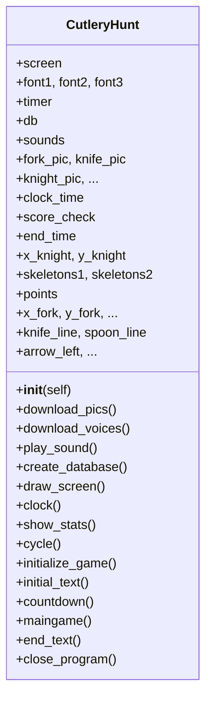

Alla oleva sekvensikaavio kuvaa pelin päätoiminnallisuutta, siis funktiota maingame().

```mermaid
graph TD
    A[maingame] --> B[draw_screen]
    A --> C[clock]
    A --> D[Render points and level]
    D --> D1[Update points text]
    D --> D2[Check points limit]
    D --> D3[Update level: difficulty level and loop speed]
    D --> D4[Display LEVEL: difficulty_level if applicable]
    A --> E[Render graphics]
    E --> E1[Display knight]
    E --> E2[Display fork]
    E --> E3[Display knife]
    E --> E4[Display spoon]
    A --> F[Handle user input]
    F --> F1[Arrow keys: up, down, left, right]
    F --> F2[Quit event]
    A --> G[Knight movement]
    G --> G1[Horizontal: left, right]
    G --> G2[Vertical: up, down]
    A --> H[Item collection]
    H --> H1[Fork]
    H --> H2[Knife]
    H --> H3[Spoon]
    A --> I[Skeletons]
    I --> I1[Initialize positions: skeletons1, skeletons2]
    I --> I2[Move skeletons]
    I --> I3[Collision detection]
    I3 --> I31[Skeleton 1 collision]
    I3 --> I32[Skeleton 2 collision]
    A --> J[End text on collision]
    A --> K[Update display]
    A --> L[Timer tick: loop speed]
